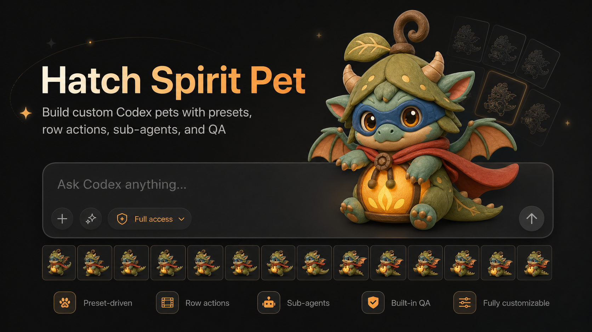

# Hatch Spirit Pet



Create Codex-compatible animated custom pets from a concept, art style, and action style. This is a Codex-first skill: the scripts prepare and validate the run, while Codex orchestrates image generation, sub-agents, repairs, and final packaging.

## Install

```bash
git clone https://github.com/sehjk/hatch-spirit-pet.git ~/.codex/skills/hatch-spirit-pet
```

To update later:

```bash
cd ~/.codex/skills/hatch-spirit-pet
git pull
```

## Open The Customizer

```bash
open ~/.codex/skills/hatch-spirit-pet/ui/index.html
```

Or from the installed skill folder:

```bash
./scripts/open_customizer.sh
```

The customizer is a static command builder. It does not call image generation, spawn sub-agents, write files, or package pets.

## Create A Pet

1. Open the customizer.
2. Enter a pet name, description, concept notes, art style, action style, and output directory.
3. Copy the generated `prepare_pet_run.py` command.
4. Run that command from the skill folder:

```bash
cd ~/.codex/skills/hatch-spirit-pet
python scripts/prepare_pet_run.py \
  --pet-name 'Luma' \
  --description 'A compact Codex spirit pet ready for sprite animation.' \
  --pet-notes 'a tiny lantern forest spirit with a sleepy face and leaf cloak' \
  --art-style 'soft-clay' \
  --action-style 'magical' \
  --output-dir "$HOME/Desktop/luma-pet-run" \
  --force
```

5. Ask Codex to finish the prepared run:

```text
Use hatch-spirit-pet to finish this run with sub-agents: /absolute/path/to/run
```

Codex will generate the base pet, delegate row-strip generation to sub-agents when available, record results, run QA, repair failed rows, assemble the atlas, and install the final pet under:

```text
~/.codex/pets/<pet-name>/
  pet.json
  spritesheet.webp
```

## Useful Codex Prompts

```text
Use hatch-spirit-pet to finish this run with sub-agents: /path/to/run
```

```text
Repair failed rows and finalize this pet: /path/to/run
```

```text
Inspect this hatch-spirit-pet run and tell me what is ready or blocked: /path/to/run
```

## Known Limits

- The UI prepares commands only.
- Python scripts do not spawn Codex sub-agents.
- Sub-agents are a Codex runtime feature, so the agentic generation path must run inside Codex.
- The default visual path uses Codex `$imagegen`; `scripts/generate_pet_images.py` is only a secondary API fallback for advanced users.
- Final pets install under `~/.codex/pets/<pet-name>/`.

See [`docs/agentic-run.md`](docs/agentic-run.md) for the parent-agent/sub-agent responsibility split.

## Development Checks

```bash
python -m py_compile scripts/*.py
node --check ui/app.js
```

Generated run folders, cache files, and local media outputs are ignored by git.
